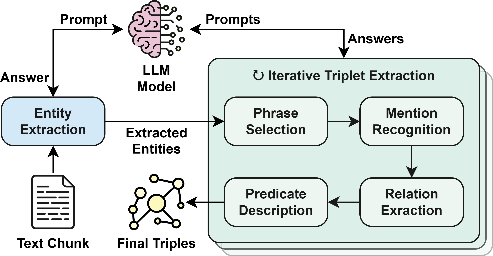

# Knowledge Graph Engineering through Iterative Zero-shot LLM Prompting

This repository hosts the codebase and dataset from the paper [***A Zero-Shot Strategy for Knowledge Graph Engineering
 Using GPT-3.5***](https://www.sciencedirect.com/science/article/pii/S1877050924026231) (formerly ***Knowledge Graph
 Engineering through Iterative Zero-Shot LLM Prompting*** in its preprint version).

## Codebase

This repository provides a *Python* implementation for an **open information extraction pipeline** powered by **large
 language models** (specifically, only the *GPT-3.5-turbo* integration is actually included). The *Python*
 implementation of this pipeline can be found in `src/llm_open_ie`.

The core objective of this pipeline is to leverage the inherent capabilities of LLMs to analyze, elaborate, and generate
 human-like text for enhancing the extraction and representation of textual information. The following is a visual
 representation of how the pipeline works, though it is better explained in the paper.

<p align="center">
  
</p>

Running the pipeline on a text chunk should return:
 - A **list of entities**, each characterized by a proper *label*, *description*, and *list of types* (hypernyms).
 - A **list of triples**, whose subjects and objects come from the above entities, and whose predicates are defined by
    a proper *label* and *description* of the relation.

### How to install
After cloning this repository, navigate to the root directory of the repository (where this README can be found) and
 run the following command using Python 3.10 or newer:

```shell
pip install .
```

:warning: To use the *GPT-3.5-turbo* large language model, **you also need an OpenAI API key**, which should be stored
 in the environmental variable `OPENAI_API_KEY`.

### Running the pipeline
The following is an example of how to execute the pipeline to extract entities and triples from a text:

```python
from llm_open_ie import oie_pipeline
from llm_open_ie.llm.gpt import GPTOpenIE

text = '<PUT YOUR TEXT HERE>'
llm_oie = GPTOpenIE()
entities, triples = oie_pipeline(text, llm_oie)
```

:warning: Since the large language model is explicitly asked to provide additional details for entities and triples,
 running the pipeline on very short texts (such as single sentences) where the required details are usually absent
 won't yield satisfactory results. Similarly, long texts lacking details for the mentioned entities will result in the
 same outcome.

## Dataset and experiments

The datasets mentioned in the paper can be found in the `dataset` folder of this repository, which includes the
 categories `ST`, `REBEL`, and `REBEL_20`. For each category, a single JSON file contains all the information about the
 used text, extracted entities/triples, and optionally human annotations. A general intuitive schema of each JSON file
 can be found in `dataset\json_schema.txt`. Additionally, each category is provided with a notebook containing the
 actual code and results of the evaluation presented in the paper. To repeat the evaluation for the `REBEL` category,
 you'll need the original REBEL dataset in the `dataset\REBEL\original` folder. You can download it manually from its
 [HuggingFace dataset card](https://huggingface.co/datasets/Babelscape/rebel-dataset/tree/main) or automatically using
 the `dataset\REBEL\original\rebel_download.sh` script.

## Citing

If you find [our work](https://www.sciencedirect.com/science/article/pii/S1877050924026231) useful, please cite:
```bib
@article{CARTA20242235,
  author = {Salvatore Carta and Alessandro Giuliani and Marco Manolo Manca and Leonardo Piano and Alessandro Sebastian Podda and Livio Pompianu and Sandro Gabriele Tiddia},
  title = {A Zero-Shot Strategy for Knowledge Graph Engineering Using GPT-3.5},
  journal = {Procedia Computer Science},
  year = {2024},
  volume = {246},
  pages = {2235-2243},
  doi = {https://doi.org/10.1016/j.procs.2024.09.573},
  url = {https://www.sciencedirect.com/science/article/pii/S1877050924026231},
  note = {28th International Conference on Knowledge Based and Intelligent information and Engineering Systems (KES 2024)},
}
```
